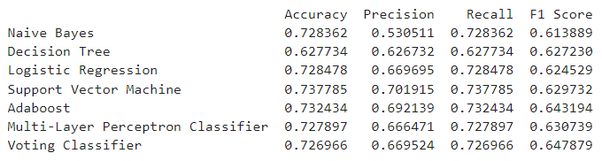

# PROJECT TITLE 
Customer Churn Prediction in Telecommunication

## NON-TECHNICAL EXPLANATION OF YOUR PROJECT
This project aims to identify customers who are likely to churn from a telecommunications company. By analyzing various features, we can predict which customers are at risk of leaving and take measures to retain them.

## DATA
The dataset used in this project was obtained from Kaggle and contains 71,047 instances with 58 attributes. The features include both numerical and categorical data. The dataset was provided by the Teradata Center for Customer Relationship Management at Duke University.

## MODEL 
We used various machine learning models such as Naive Bayes, Decision Tree, Logistic Regression, Support Vector Machine, Adaboost, Multi-Layer Perceptron Classifier, and Voting Classifier. The purpose of the models is to classify customer churn and predict which customers are likely to leave the telecommunications company.

## HYPERPARAMETER OPTIMSATION
We optimized the hyperparameters of the models using Bayesian optimization approaches. By selecting the best hyperparameters, we can improve the performance of the models and obtain more accurate predictions. Information on the parameter can be find in the jupyter notebook attached.

## RESULTS
Summary of the model performance as attached below:

The best-performing model is the Support Vector Machine, which achieved an accuracy of 73.8%, an F1 score of 63.0%, a precision of 70.2%, and a recall of 73.8%. These results indicate that the Support Vector Machine can effectively predict customer churn in the telecommunications industry. Insights gained from this model can help companies to develop strategies to retain customers and improve business performance.
